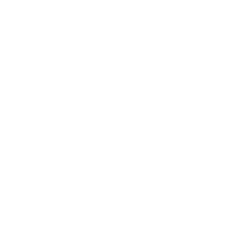

For over 30 probability distributions, this library provides:

* Random variable generation
* Density, Probability, Survival and Quantile functions

Mathematical functions are tested for high precision and
RNG tested to correctly fit the distribution

# Installation
Builds static library with header file, optionally run tests
```bash
$ zig build -Doptimize=ReleaseFast
$ zig build test
$ zig build correctness -Doptimize=ReleaseFast
```

# [Documentation](https://paulocampana.github.io/random_variable)

# Importing Zig module
```bash
$ zig fetch --save git+https://github.com/PauloCampana/random_variable
```

```zig
// build.zig
const rv = b.dependency("random_variable", .{
    .target = target,
    .optimize = optimize,
});

exe.root_module.addImport("random_variable", rv.module("random_variable"));
```

```zig
// main.zig
const rv = @import("random_variable");
```
